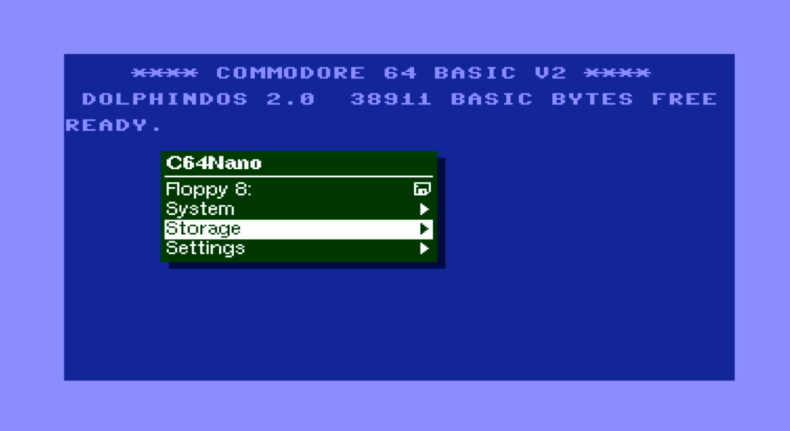

# C64Nano
The C64Nano is a port of some [MiST](https://github.com/mist-devel/mist-board/wiki) and 
[MiSTer](https://mister-devel.github.io/MkDocs_MiSTer/) core components of the
[C64](https://en.wikipedia.org/wiki/Commodore_64) for the :

| Board      | FPGA       | support |Note|
| ---        |        -   | -     |-|
| [Tang Nano 20k](https://wiki.sipeed.com/nano20k)     | [GW2AR](https://www.gowinsemi.com/en/product/detail/38/)  | X |- |
| [Tang Primer 25K](https://wiki.sipeed.com/hardware/en/tang/tang-primer-25k/primer-25k.html) | [GW5A-25](https://www.gowinsemi.com/en/product/detail/60/)  | X |no Dualshock 2, no Retro DB9 Joystick |
| [Tang Mega 60k NEO](https://wiki.sipeed.com/hardware/en/tang/tang-mega-60k/mega-60k.html)|[GW5AT-60](https://www.gowinsemi.com/en/product/detail/60/)| planned |- |
| [Tang Mega 138k Pro](https://wiki.sipeed.com/hardware/en/tang/tang-mega-138k/mega-138k-pro.html)|[GW5AST-138](https://www.gowinsemi.com/en/product/detail/60/) | X |- |


Be aware that the [VIC20](https://en.wikipedia.org/wiki/VIC-20) had been ported too in similar manner ([VIC20Nano](https://github.com/vossstef/VIC20Nano)).<br>
Also the [Atari 2600 VCS](https://en.wikipedia.org/wiki/Atari_2600) had been ported ([A2600Nano](https://github.com/vossstef/A2600Nano)).<br>
<br>
This project relies on a [M0S Dock µC](https://wiki.sipeed.com/hardware/en/maixzero/m0s/m0s.html) being connected to the Tang Nano 20K.<br> Alternately you can use a [Raspberry Pi Pico](https://www.raspberrypi.com/documentation/microcontrollers/pico-series.html) or [esp32-s2](https://www.espressif.com/en/products/socs/esp32-s2)/[s3](https://www.espressif.com/en/products/socs/esp32-s3) and use the [FPGA companion firmware](http://github.com/harbaum/FPGA-Companion).

Original C64 core by Peter Wendrich<br>
All HID components and µC firmware by Till Harbaum<br>
c1541 by https://github.com/darfpga<br>

Features:
* PAL 800x576p@50Hz or NTSC 800x480p@60Hz HDMI Video and Audio Output
* USB Keyboard via µC (Sipeed M0S Dock BL616 / Raspberry Pi Pico RP2040 / ESP32 S2/S3)
* [USB Joystick](https://en.wikipedia.org/wiki/Joystick) via µC
* [USB Mouse](https://en.wikipedia.org/wiki/Computer_mouse) via µC as [c1351](https://en.wikipedia.org/wiki/Commodore_1351) Mouse emulation
* [USB Gamepad](https://en.wikipedia.org/wiki/Gamepad) Stick via µC as [Paddle](https://www.c64-wiki.com/wiki/Paddle) Emulation<br>
* [legacy D9 Joystick](https://en.wikipedia.org/wiki/Atari_CX40_joystick) (Atari / Commodore digital type) [MiSTeryNano shield](https://github.com/harbaum/MiSTeryNano/tree/main/board/misteryshield20k/README.md)<br>
* Joystick emulation on Keyboard Numpad<br>
* [Dualshock 2 Gamepad](https://en.wikipedia.org/wiki/DualShock) Keys & Stick as Joystick<br>
* [Dualshock 2 Gamepad](https://en.wikipedia.org/wiki/DualShock) Sticks as [Paddle](https://www.c64-wiki.com/wiki/Paddle) Emulation (analog mode)<br>
* Emulation of [C64GS Cheetah Annihilator](https://en.wikipedia.org/wiki/Commodore_64_Games_System) joystick 2nd Trigger Button (Pot X/Y)
* emulated [1541 Diskdrive](https://en.wikipedia.org/wiki/Commodore_1541) on FAT/extFAT microSD card with parallel bus [Speedloader Dolphin DOS 2](https://rr.pokefinder.org/wiki/Dolphin_DOS). [GER manual](https://www.c64-wiki.de/wiki/Dolphin_DOS)<br>
* c1541 DOS ROM selection
* Cartridge ROM (*.CRT) loader
* Direct BASIC program (*.PRG) injection loader
* Tape (*.TAP) image loader as [C1530 Datasette](https://en.wikipedia.org/wiki/Commodore_Datasette)
* Loadable 8K Kernal ROM (*.BIN)
* [VIC-II](https://en.wikipedia.org/wiki/MOS_Technology_VIC-II) revision and [6526](https://en.wikipedia.org/wiki/MOS_Technology_CIA) / 8521 selection
* [SID](https://en.wikipedia.org/wiki/MOS_Technology_6581) revision 6581 or 8580 selectable
* 2nd dual SID Option and loadable Filter curves
* emulated [RAM Expansion Unit (REU)](https://en.wikipedia.org/wiki/Commodore_REU) or [GeoRAM](https://en.wikipedia.org/wiki/GeoRAM)<br>
* On Screen Display (OSD) for configuration and loadable image selection (D64/G64/CRT/PRG/BIN/TAP/FLT)<br>
* Physical MIDI-IN and OUT [MiSTeryNano shield](https://github.com/harbaum/MiSTeryNano/tree/main/board/misteryshield20k/README.md)<br>
* RS232 Serial Interface [VIC-1011](http://www.zimmers.net/cbmpics/xother.html) or [UP9600](https://www.pagetable.com/?p=1656) mode to Tang onboard USB-C serial port or external hw pin.
* Freezer support (e.g. Action Replay)
<br>

<br>

HID interfaces aligned in pinmap and control to match [MiSTeryNano project's bl616 misterynano_fw](https://github.com/harbaum/MiSTeryNano/tree/main/firmware/misterynano_fw)
respectively [FPGA-Companion](https://github.com/harbaum/FPGA-Companion)<br>
Basically a µC acts as USB host for USB devices and as an OSD controller using a [SPI communication protocol](https://github.com/harbaum/MiSTeryNano/blob/main/SPI.md).<br>

**Note** PROJECT IS STILL WORK IN PROGRESS
<br>
## Installation

The installation of C64 Nano on the Tang Nano 20k board can be done using a Linux PC or a Windows PC
[(Instruction)](INSTALLATION_WINDOWS.md).<br>

## c64 Nano on Tang Primer 25K
See [Tang Primer 25K](TANG_PRIMER_25K.md)

## c64 Nano on Tang Mega 138k Pro
See [Tang Mega 138K](TANG_MEGA_138K.md)

## emulated Diskdrive c1541
Emulated 1541 on a regular FAT/exFAT formatted microSD card including parallel bus Speedloader Dolphin DOS 2.0.<br>
Copy a D64 Disk image to your sdcard and rename it to **disk8.d64** as default boot image.<br>
Add further D64 or G64 images as you like and insert card in TN slot. LED 0 acts as Drive activity indicator.<br> 
> [!TIP]
Disk directory listing: [(or F7 keypress)](https://project64.c64.org/hw/dolphindos.txt)<br> 
command: <br>
LOAD"$",8<br>
LIST<br> 
Load first program from Disk: (or just LOAD if Dolphin Kernal active)<br> 
LOAD"*",8<br>
RUN<br>

c1541 DOS ROM can be selected from OSD (default Dolphin DOS 2.0, CBM DOS, SpeedDos Plus or JiffyDOS)<br>
In case a program don't load correctly select via OSD the factory default CBM DOS an give it a try.

## Cartridge ROM Loader (.CRT)
Cartridge ROM can be loaded via OSD file selection.<br>
Copy a *.CRT to your sdcard and rename it to **c64crt.crt** as default boot cartridge ROM.<br>
Prevent the cartridge load at boot by OSD CRT selection **No Disk** , **Save settings** and System **Cold Boot**.<br>
> [!TIP]
**Detach Cartridge** by OSD :<br>
```temporary``` **Cartridge unload & Reset**  
```permanent``` **No Disk**, **Save settings** and System **Cold Boot**.<br>

> [!IMPORTANT]
> Be aware that some Freezer Card CRT might require to use the standard C64 Kernal and the standard C1541 CBM DOS.

## BASIC Program Loader (.PRG)
A BASIC Program *.PRG file can be loaded via OSD file selection.<br>
Copy a *.PRG to your sdcard and rename it to **c64prg.prg** as default boot basic program. Prevent the PRG load at boot by OSD PRG selection **No Disk** , **Save settings** and **Reset** or System **Cold Boot**.<br>
> [!TIP]
Check loaded file by command: **LIST**<br>

> [!IMPORTANT]
command: **RUN**<br>

## Tape Image Loader (*.TAP)
A [Tape](https://en.wikipedia.org/wiki/Commodore_Datasette) *.TAP file can be loaded via OSD file selection<br>
In order to start a tape download choose C64 CBM Kernal (mandatory as Dolphin DOS doesn't support Tape). Best to save Kernal OSD selection via **Save settings**.<br>
> [!IMPORTANT]
command: **LOAD**<br>
___ Only if you have [Exbasic Level II](https://www.c64-wiki.de/index.php?title=Exbasic_Level_II&oldid=261004) .CRT Basic loaded then use command: **LOAD***<br>
Screen will blank!<br>

The file is loaded automatically as soon as TAP file selected via OSD (no need to press PLAY TAPE button) in case ***no** TAP had been previously selected*.<br>
As mentioned screen will blank for several seconds and then display briefly the filename of the to be loaded file. It will blank shortly afterwards again till load completed and take a lot of time...<br>
Copy a *.TAP to your sdcard and rename it to **c64tap.tap** as default tape mountpoint.<br>
For **Tape unload** use OSD TAP selection **No Disk** and **Reset** or System **Cold Boot**.<br>
> [!WARNING]
After board power-up or coldboot a TAP file will **not autoloaded** even if TAP file selection had been saved or c64tap.tap mountpoint available !<br>
Unblock loader by OSD TAP selection **No Disk** or simply select again the desired TAP file to be loaded after you typed **LOAD**<br>

> [!TIP]
Check loaded file by command: **LIST**<br>

> [!IMPORTANT]
command: **RUN**<br>

> [!NOTE]
The available (muffled) Tape Sound audio can be disabled from OSD.<br>

## Kernal Loader (.BIN)
The build-in Dolphin Kernal is the power-up default C64 Kernal with an excellent C1541 speedloader.
> [!TIP]
If you are fine with that then there is no need to load another Kernal via OSD and just select OSD Kernal BIN selection **No Disk** and **Save settings**!<br>

In general Kernal ROM files *.BIN can be loaded via OSD selection.<br>
Copy a 8K C64 Kernal ROM *.BIN to your sdcard and rename it to **c64kernal.bin** as default boot Kernal.<br>
Prevent Kernal load by OSD Kernal BIN selection **No Disk** and **Save settings** and do a **power-cyle** of the board. In this case the build-in Dolphin Kernal will by default be used after next power cycle.<br>

## SID Filter Curve (.FLT)
Custom Filters curves can optionally be loaded via OSD. 
> [!TIP]
> This is in most cases not needed and build-in filters curves are already an optimum.

> [!NOTE]
Remember to select the 6581 chip, not the 8580.
Select 'Custom 1' as the filter to activate it.<br> When a custom filter is loaded, there's no difference between custom options Custom 1, 2, and 3. Selecting 'Default' switches back to the built-in filter curve.<br>

Prevent Filter curve load by OSD Kernal **FLT** selection **No Disk** and **Save settings** and **power-cyle** of the board.<br>

## Core Loader Sequencing
The core will after power cycle/ cold-boot start downloading the images on the sdcard in the following order:
> [!NOTE] 
(1) BIN Kernal, (2) CRT ROM, (3) PRG Basic and finally (4) FLT.<br>

## emulated RAM Expansion Unit REU 1750
For those programs the require a [RAM Expansion Unit (REU)](https://en.wikipedia.org/wiki/Commodore_REU) it can be activated by OSD on demand.<br>
<br>
Playing [Sonic the Hedgehog V1.2](https://csdb.dk/release/?id=212523)<br>
Enable REU, and load the PRG.<br>
Playing around with [GEOS](https://en.wikipedia.org/wiki/GEOS_(8-bit_operating_system))<br>
Enable REU, select c1541 CBM DOS ROM and load the PRG.<br>

## Push Button utilization
* S2 keep pressed during power-up for FLASH programming of FPGA bitstream<br>
> [!CAUTION]
A FLASH programm attempt without keeping the board in reset may lead to corruption of the C1541 DOS images stored in FLASH requiring re-programming.
* S1 swap the Joystick Ports if OSD **Swap Joys** is set to Off mode.<br>

## OSD
invoke by F12 keypress<br>
* Reset<br>
* Cold Reset + memory scrubbing<br>
* Audio Volume + / -<br>
* Scanlines effect %<br>
* Widescreen activation<br>
* HID device selection for Joystick Port 1 and Port 2<br>
* REU activation<br>
* c1541 Drive disk image selection<br>
* c1541 Disk write protetcion<br>
* c1541 Reset<br>
* c1541 DOS ROM selection<br>
* MIDI configuration<br>
* PAL / NTSC Video mode<br>
* VIC-II revision, 6526 / 8521 and SID 6561/8580 selection
* SID Filter selection
* geoRAM activation
* Loader (CRT/PRG/BIN/TAP/FLT) file selection<br>
* Joystick Port Swap
* Cartridge unload

## Gamecontrol support
legacy single D9 Digital Joystick. OSD: **Retro D9**<br>
Atari ST type of Joystick 2nd button supported using a MiSTeryNano shield.  
Don't configure e.g. [ArcadeR](https://retroradionics.com) for C64 mode rather than<br> normal digital 2nd button mode (2nd trigger button connect signal to ground)

or<br>
USB Joystick(s). OSD: **USB #1 Joy** or **USB #2 Joy** <br>
Also [RII Mini Keyboard i8](http://www.riitek.com/product/220.html) left Multimedia Keys are active if **USB #1 Joy** selected. 

or<br>
Gamepad Stick as Joystick. OSD: **DualShock 2**
<br>left **stick digital** for Move and **square** , **cross**  and **circle** Button for 3 Trigger buttons  
or following **Pad** controls:<br>
| Buttons | - | - |
| - | - | -  |
| square<br>Trigger | Up  | cross<br>Trigger 2 |
| Left | - | Right |
| - | Down | circle<br>Trigger 3 |<br>

or Keyboard Numpad. OSD: **Numpad**<br>
| | | |
|-|-|-|
|0<br>Trigger|8<br>Up|.<br>Trigger 2|
|4<br>Left|-|6<br>Right|
|-|2<br>Down|-|

or Mouse. OSD: **Mouse**<br>
USB Mouse as c1351 Mouse emulation.

or Dualshock2 Gamepad as Paddle. OSD: **DualShock Paddle**<br>
Dualshock 2 Sticks in analog mode as VC-1312 Paddle emulation.<br>
**square** , **cross**, **circle** and **triangle** used as 4 Trigger buttons<br>
You have first to set the DS2 Sticks into analog mode by pressing the DS2 ANALOG button. Mode indicated by red light indicator.<br>Configure DIGITAL mode (press ANALOG button again) when using the **Joystick** mode again and set OSD: **DualShock 2**<br>

or USB Paddle. OSD: **USB #1 Padd** or **USB #2 Padd** <br>
Left Stick in X / Y analog mode as VC-1312 Paddle emulation.<br>
Button **1 / 2** as Trigger<br>

## Keyboard 
 
 PAGE UP (Tape Play) Key or the Tang S1 Button swap the Joystick Ports if OSD **Swap Joys** is set to Off mode.

 F11 (RESTORE) Key as ``FREEZE``. Typically used by Freezer Cards like Action Replay, Snappy Rom etc. 
## LED UI

| LED | function | TN20K | TP25K | TM138K |
| --- |        - | -     | -     | -      |
| 0 | c1541 activity  | x | x | x |
| 1 | D64 selected | x | - | x |
| 2 | CRT seleced | x | - | x |
| 3 | PRG selected | x | - | x |
| 4 | Kernal selected  | x | - | x |
| 5 | TAP selected | x | - | x |

Solid **<font color="red">red</font>** of the c1541 led after power-up indicates a missing DOS in Flash<br>

**Multicolor RGB LED**
* **<font color="green">green</font>**&ensp;&thinsp;&ensp;&thinsp;&ensp;&thinsp;all fine and ready to go<br>
* **<font color="red">red</font>**&ensp;&thinsp;&ensp;&thinsp;&ensp;&thinsp;&ensp;&thinsp;&ensp;&thinsp;something wrong with SDcard / default boot image<br>
* **<font color="blue">blue</font>**&ensp;&thinsp;&ensp;&thinsp;&ensp;&thinsp;&ensp;&thinsp;µC firmware detected valid FPGA core<br>
* **<font color="yellow">yellow</font>**&ensp;&thinsp;&ensp;&thinsp;&ensp;&thinsp;FPGA core can't detect valid firmware<br>
* **white**&ensp;&thinsp;&ensp;&thinsp;&ensp;&thinsp;-<br>

## MIDI-IN and OUT
Type of MIDI interface can be selected from OSD.<br> There is support for Sequential Inc., Passport/Sentech, DATEL/SIEL/JMS/C-LAB and Namesoft<br>
You can use a [MiSTeryNano MIDI shield](https://github.com/harbaum/MiSTeryNano/tree/main/board/misteryshield20k/README.md) to interface to a Keyboard.<br>
## RS232 Serial Interface 
The Tang onboard USB-C serial port can be used for communication with the C64 Userport Serial port in [VIC-1011](http://www.zimmers.net/cbmpics/xother.html) or [UP9600](https://www.pagetable.com/?p=1656) mode.<br>
Terminal programs need the Kernal serial routines therefore select via OSD the CBM Kernal rather than default DolphinDOS.<br> For a first start use UP9600 mode and a Terminal program like [ccgms](https://github.com/mist64/ccgmsterm) and on the PC side [Putty](https://www.putty.org) with 2400 Baud.<br>

OSD selection allows to change in between TANG USB-C port or external HW pin interface.<br>

|            |        |      |     |
|  -         |   -    |   -  | -   |
| Board      |RX (I) FPGA |TX (O) FPGA|Note|
| TN20k      |31      | 77   |[pinmap](https://wiki.sipeed.com/hardware/en/tang/tang-nano-20k/nano-20k.html#Pin-diagram), misterynano io(6) / io(7)|
| TP25k      |K5      | L5   | J4-6  J4-5, share M0S Dock PMOD|
| TM138k Pro |H15     | H14  | J24-6 J24-5, share M0S Dock PMOD |

Remember that in + out to be crossed to connect to external device. Level are 3V3 tolerant.
## Powering
Prototype circuit with Keyboard can be powered by Tang USB-C connector from PC or a Power Supply Adapter. 
## Synthesis
Source code can be synthesized, fitted and programmed with GOWIN IDE Windows or Linux.<br>
Alternatively use the command line build script **gw_sh.exe** build_tn20k.tcl, build_tp25k.tcl or build_tm138k.tcl<br>
## Pin mapping 
see pin configuration in .cst configuration file
## HW circuit considerations
**Pinmap TN20k Interfaces** <br>
 Sipeed M0S Dock, digital Joystick D9 and DualShock Gamepad connection.<br>
 

**Pinmap D-SUB 9 Joystick Interface** <br>
- Joystick interface is 3.3V tolerant. Joystick 5V supply pin has to be left floating !<br>


| Joystick pin |IO| Tang Nano pin | FPGA pin | Joystick Function |
| ----------- |-----| ---   | --------  | ----- |
| 1 |2| J6 10  | 25   | UP | 
| 2 |1| J6 9  | 28 | DOWN |
| 3 |4| J6 12 | 29 | LEFT |
| 4 |3| J5 11 | 26 | RIGHT |
| 5 |-| - | - | POT Y/ TRIGGER 3| - |
| 6 |0| J5 8 | 27 | TRIGGER|
| 7 |-| n.c | n.c | 5V | - |
| 8 |-| J5 20 | - | GND | - |
| 9 |-| - | MiSTeryNano shield only | POT X/ TRIGGER 2| |

**Pinmap Dualshock 2 Controller Interface** <br>

| DS pin | Tang Nano pin | FPGA pin | DS Function |
| ----------- | ---   | --------  | ----- |
| 1 | J5 18 | 71 MISO | JOYDAT  |
| 2 | J5 19 | 53 MOSI  | JOYCMD |
| 3 | n.c. | - | 7V5 |
| 4 | J5 15 | - | GND |
| 5 | J5 16| - | 3V3 |
| 6 | J5 17 | 72 CS | JOYATN|
| 7 | J5 20 | 52 MCLK | JOYCLK |
| 8 | n.c. | - | JOYIRQ |
| 9 | n.c. | - | JOYACK |


## Getting started

In order to use this Design the following things are needed:

[Sipeed M0S Dock](https://wiki.sipeed.com/hardware/en/maixzero/m0s/m0s.html) or Raspberry Pi Pico RP2040 or ESP32-S2/S3<br>
[Sipeed Tang Nano 20k](https://wiki.sipeed.com/nano20k) <br>
or [Sipeed Tang Primer 25k](https://wiki.sipeed.com/hardware/en/tang/tang-primer-25k/primer-25k.html)<br>
and [PMOD DVI](https://wiki.sipeed.com/hardware/en/tang/tang-PMOD/FPGA_PMOD.html#PMOD_DVI)<br>
and [PMOD TF-CARD](https://wiki.sipeed.com/hardware/en/tang/tang-PMOD/FPGA_PMOD.html#PMOD_TF-CARD)<br>
and [PMOD SDRAM](https://wiki.sipeed.com/hardware/en/tang/tang-PMOD/FPGA_PMOD.html#TANG_SDRAM)<br>
and [M0S PMOD adapter](https://github.com/harbaum/MiSTeryNano/tree/main/board/m0s_pmod/README.md)
 or ad hoc wiring + soldering.<br>
or [Sipeed Tang Mega 138k Pro](https://wiki.sipeed.com/hardware/en/tang/tang-mega-138k/mega-138k-pro.html)<br>
and [PMOD SDRAM](https://wiki.sipeed.com/hardware/en/tang/tang-PMOD/FPGA_PMOD.html#TANG_SDRAM)<br>
and [PMOD DS2x2](https://wiki.sipeed.com/hardware/en/tang/tang-PMOD/FPGA_PMOD.html#PMOD_DS2x2)<br>
and [M0S PMOD adapter](https://github.com/harbaum/MiSTeryNano/tree/main/board/m0s_pmod/README.md)<br>
microSD or microSDHC card FAT32 formatted<br>
TFT Monitor with HDMI Input and Speaker<br>
<br>

| HID and Gamecontrol Hardware option | TN20k needs | alternative option |Primer 25K|Mega 138K|
| ----------- | --- | ---  | ---| -|
| USB Keyboard | [USB-C to USB-A adapter](https://www.aliexpress.us/item/3256805563910755.html) | [4 port mini USB hub HS8836A](https://a.aliexpress.com/_EIidgjH)  |x|x|
| [USB Joystick(s)](https://www.speedlink.com/en/COMPETITION-PRO-EXTRA-USB-Joystick-black-red/SL-650212-BKRD)| [4 port mini USB hub HS8836A](https://a.aliexpress.com/_EIidgjH) | - |x|x|
| USB Mouse   | [4 port mini USB hub HS8836A](https://a.aliexpress.com/_EIidgjH)  | -  |x|x|
| USB Gamepad |[4 port mini USB hub HS8836A](https://a.aliexpress.com/_EIidgjH)  | -  |x|x|
| Commodore/[Atari](https://en.wikipedia.org/wiki/Atari_CX40_joystick) compatible retro D9 Joystick| [MiSTeryNano shield](https://github.com/harbaum/MiSTeryNano/tree/main/board/misteryshield20k/README.md)|D-SUB 9 M connector, breadboard to wire everything up, some jumper wires|-|-|
| [Dualshock 2 Controller Gamepad](https://en.wikipedia.org/wiki/DualShock) | Gamepad Adapter Board (Sipeed Joystick to DIP) respectively<br> PMOD DS2x2 | breadboard to wire everything up and some jumper wires |-|x|
