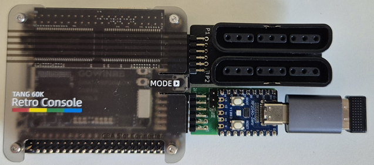
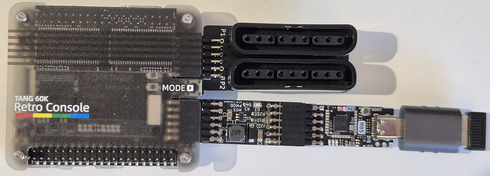

# C64 Nano on Tang Console 60K NEO

C64 Nano can be used in the [Tang Console 60K NEO](https://wiki.sipeed.com/hardware/en/tang/tang-console/mega-console.html).

Besides the significantly bigger FPGA over the Tang Nano 20K, the Tang Mega 60K adds several more features of
which some can be used in the area of retro computing as well. 

The Tang Console comes with DDR3-SDRAM as well as a slot for the [Tang
SDRAM](https://wiki.sipeed.com/hardware/en/tang/tang-PMOD/FPGA_PMOD.html#TANG_SDRAM). Using
this board allows to use the same SDR-SDRAM memory access
methods.  

The M0S Dock required to control the C64 Nano is to be mounted in the
**lower right PMOD** connector with the help of the [M0S PMOD adapter](board/m0s_pmod).

Alternatively a [PMOD RP2040-Zero](/board/pizero_pmod/README.md) can be plugged right away into the **lower right PMOD** connector.

An optional Plastation Dualshock 2 PMOD may by inserted in the second PMOD
closer to the HDMI connector. 

The firmware for the M0S Dock / PiPico is the [same version as for the Tang
Nano 20K and all other boards](https://github.com/harbaum/FPGA-Companion).

The whole setup will look like this:

