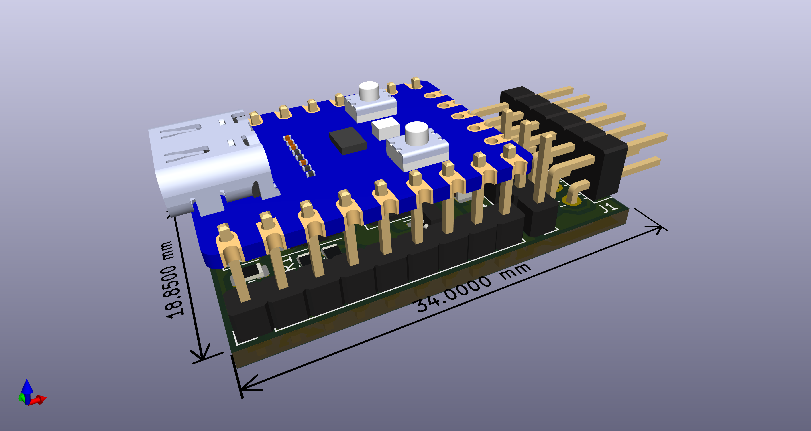
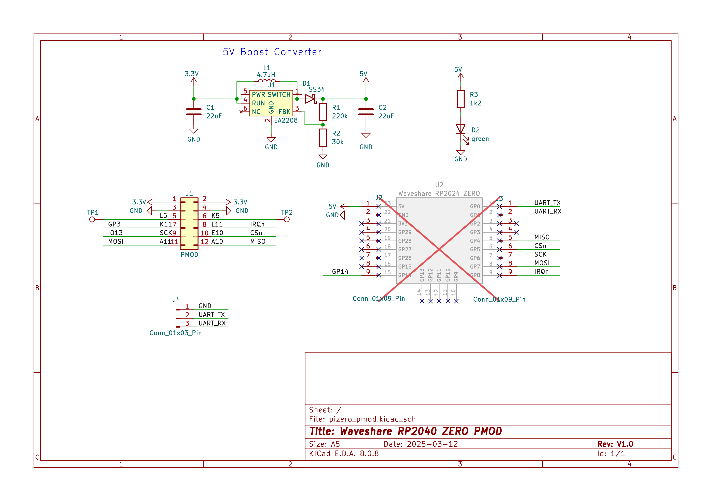
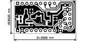

# PMOD PI-Zero

Features:
* PMOD carrier for a [RP2040-ZERO](https://www.waveshare.com/wiki/RP2040-Zero)
* USB-C to a USB-C HUB
* Debug header for Pico UART
* PMOD spare signals on Testpoints
* [CERN-OHL-S](https://cern-ohl.web.cern.ch/home) license

PCBA production files for [JLCPCB](https://jlcpcb.com) are availble [here](production).  
(Fully assembled boards can orderd based on BOM partlist, excluding the RP2040-Zero)  

> [!IMPORTANT]
> Pin headers are already assembled  
> Take the RP2040-Zero variant without pin headers !

  
  
  

| Pin | Signal   | Description |
|-----|----------|---------------------|
| GP0 | UART_TX  | Serial debug output |
| GP1 | UART_RX  | Serial debug input  |
| GP4 | MISO     | SPI data from FPGA  |
| GP5 | CSn      | SPI chip select to FPGA |
| GP6 | SCK      | SPI clock to FPGA   |
| GP7 | MOSI     | SPI data to FPGA    |
| GP8 | IRQn     | SPI interrupt from FPGA |
| GP14| spare    | spare               |

